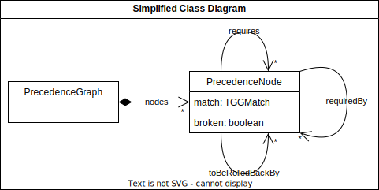

# Precedence Graph

A precedence graph is a directed acyclic graph which (in its basic form) describes applied rules and their dependencies. A node represents a rule application. An edge between two nodes represents the dependency of a rule application from another rule application. When, additionally, model changes are considered, the nodes of a precedence graph can be annotated with information that help to identify e.g. repairable spots in the model or change conflicted areas (for more see [Fritsche, et al. (2020), Chapter 3 and 4.1](https://doi.org/10.1145/3426425.3426931)).

## Implementation

The `PrecedenceGraph` of the INTEGRATE framework is implemented as a set of nodes which themselves contain references to their depending nodes (`requires`) and vice versa (`requiredBy`). Each node is tightly coupled with its respective `TGGMatch` and has an indicator (`broken`) if the rule application it represents has become invalid. Moreover, each node has a reference to all required nodes that are broken or (transitively) depending on broken nodes (`toBeRolledBackBy`). The `PrecedenceGraph`, additionally, holds several caching sets and maps to boost performance.

### Construction

The `PrecedenceGraph` is constructed dynamically at runtime and immediately reflects changes to the set of matching patterns. To achieve this, the `PrecedenceGraph` registers itself with the `MatchDistributor` (which is connected to the pattern matcher) to get notified if matches change. For a precedence graph only *consistency*, *source*, and *target* matches are needed.

For each newly appearing match a new node is created and integrated into the existing graph. This is done in the `addMatch()`-method by, first, collecting all elements of the match which would be needed to apply a respective rule application (`requiredElts`) and all elements of the match which would be created by a respective rule application (`translatedElts`). These elements are then registered in maps in the `PrecedenceGraph`, which map every match onto its requiring and translating elements as well as vice versa (`requires`, `requiredBy`, `translates`, `translatedBy`). From there, all in- and outgoing edges can be easily determined by looking up which required elements are translated by which other nodes, and which translated elements are required by which other nodes.

In addition to the node creation and linking process, the `toBeRolledBackBy`-reference is populated. This is done by iterating over the required nodes and check if they are broken or if their `toBeRolledBackBy`-reference is not empty (which we call *implicitly broken*). Additionally, all nodes that can be reached by traversing along the `requiredBy`-direction also needs to be updated.

To also keep track of broken nodes, disappearing *consistency* matches are not removed from the `PrecedenceGraph`. Instead, their respective nodes are marked as broken and the *implicitly broken* status of all (transitively) depending nodes is updated. Broken nodes remain in the `PrecedenceGraph` until their respective match appears again (meaning the rule application is restored) or the rule application is rolled back. 